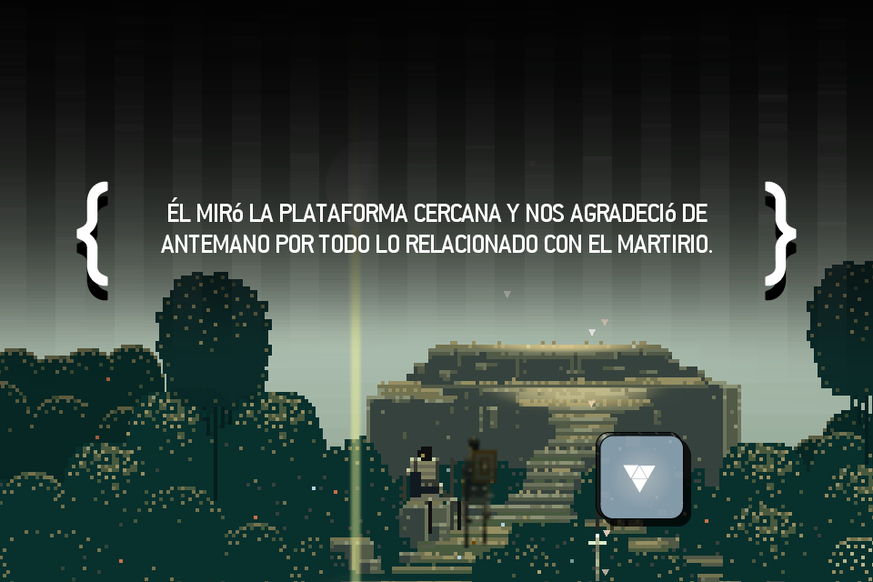
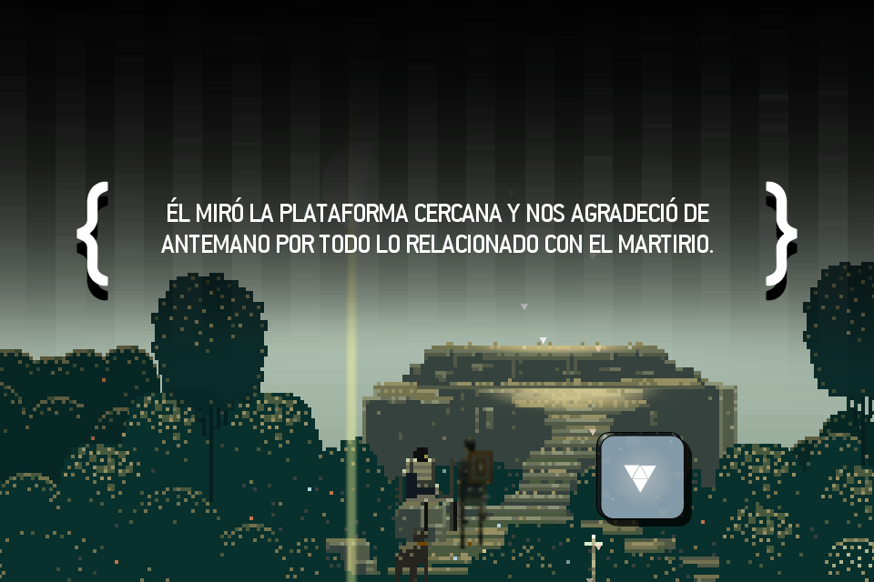
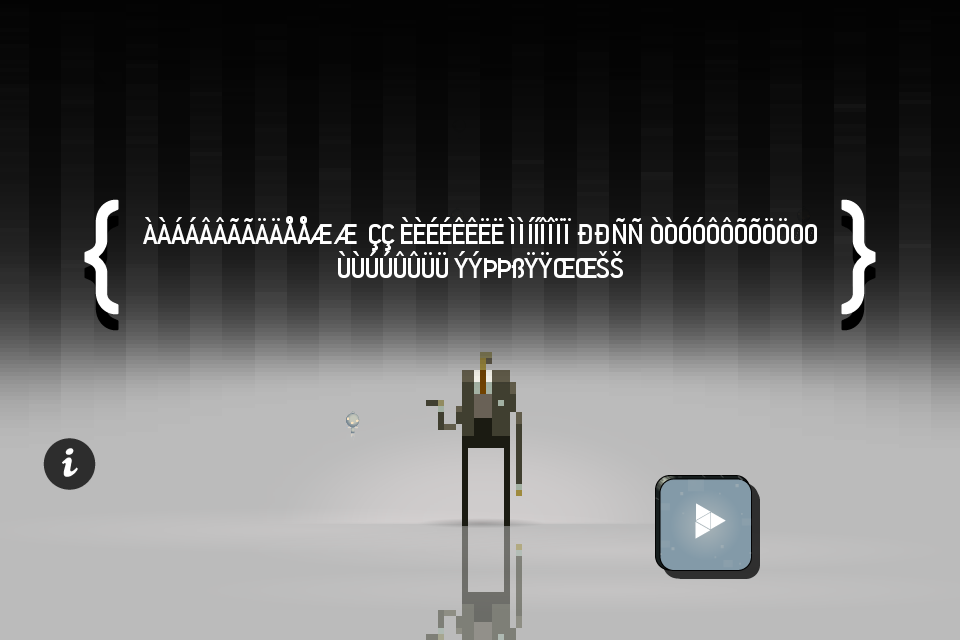
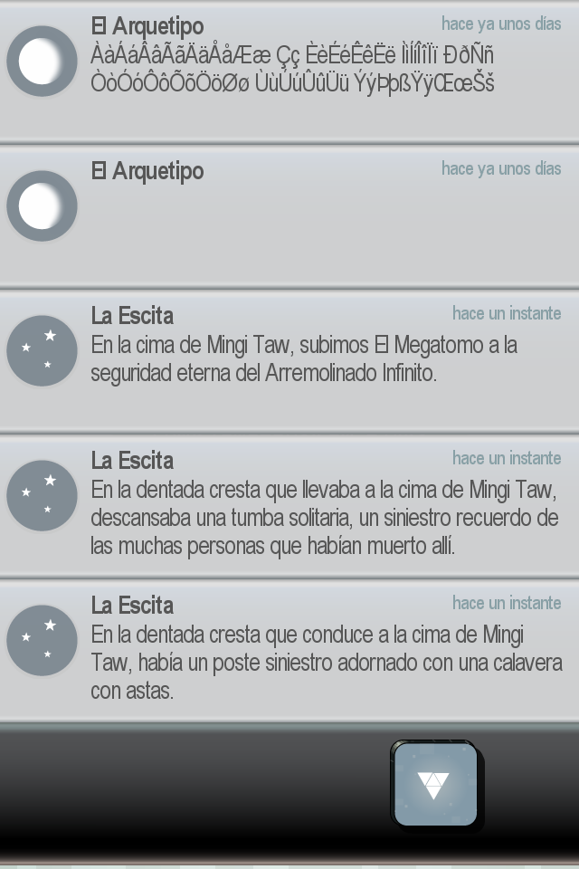

## Modification of Font Files to Support Special Characters in the Game

This README.md file describes the changes made to the game's font files in order to properly support special characters. In particular, a modification was made to the "Conduit ITC" font to ensure that texts are always displayed in uppercase.

### Problem Description

In the game, when using the "Conduit ITC" font, the text is transformed into uppercase. However, it cannot convert special characters, which remain in lowercase. This limitation results in inconsistency within the uppercase text, particularly in languages that rely on these special characters. For instance, the word "Cáucaso" would be converted as "CáUCASO" instead of "CÁUCASO" due to the lowercase representation of the letter "Á". While the game successfully capitalizes most of the text, it faces difficulties with special characters.



### Implemented Solution

To solve this issue, the following approach was taken:

1. Special characters present in the game that required proper rendering were identified.

2. The lowercase special characters were replaced with their corresponding uppercase versions in the font files (conduit_itc.fnt, conduit_itc_2x.fnt, conduit_itc_4x.fnt).

3. Relevant attributes of the characters in the XML font files were modified. The attributes that were updated include: "x", "y", "width", "height", "xoffset", "yoffset", "xadvance", "page", and "chnl".



### Example of Modification

Let's take the character "á" (Unicode 225) as an example and observe how its attributes were substituted with their corresponding uppercase variant "Á" (Unicode 193) in the conduit_itc.fnt font.

Before modification:
```xml
<char id="193" x="53" y="0" width="8" height="14" xoffset="0" yoffset="0" xadvance="7" page="0" chnl="15" />
...
<char id="225" x="20" y="45" width="6" height="11" xoffset="0" yoffset="3" xadvance="7" page="0" chnl="15" />
```

After modification:
```xml
<char id="193" x="53" y="0" width="8" height="14" xoffset="0" yoffset="0" xadvance="7" page="0" chnl="15" />
...
<char id="225" x="53" y="0" width="8" height="14" xoffset="0" yoffset="0" xadvance="7" page="0" chnl="15" />
```

### Correspondence Table of Modified Characters

The following table displays the characters that were replaced and their corresponding Unicode decimal codes:


| Character | Code | Replaced | Code |
|-----------|------|----------|------|
| A         | 65   | a        | 97   |
| B         | 66   | b        | 98   |
| C         | 67   | c        | 99   |
| D         | 68   | d        | 100  |
| E         | 69   | e        | 101  |
| F         | 70   | f        | 102  |
| G         | 71   | g        | 103  |
| H         | 72   | h        | 104  |
| I         | 73   | i        | 105  |
| J         | 74   | j        | 106  |
| K         | 75   | k        | 107  |
| L         | 76   | l        | 108  |
| M         | 77   | m        | 109  |
| N         | 78   | n        | 110  |
| O         | 79   | o        | 111  |
| P         | 80   | p        | 112  |
| Q         | 81   | q        | 113  |
| R         | 82   | r        | 114  |
| S         | 83   | s        | 115  |
| T         | 84   | t        | 116  |
| U         | 85   | u        | 117  |
| V         | 86   | v        | 118  |
| W         | 87   | w        | 119  |
| X         | 88   | x        | 120  |
| Y         | 89   | y        | 121  |
| Z         | 90   | z        | 122  |
| À         | 192  | à        | 224  |
| Á         | 193  | á        | 225  |
| Â         | 194  | â        | 226  |
| Ã         | 195  | ã        | 227  |
| Ä         | 196  | ä        | 228  |
| Å         | 197  | å        | 229  |
| Æ         | 198  | æ        | 230  |
| Ç         | 199  | ç        | 231  |
| È         | 200  | è        | 232  |
| É         | 201  | é        | 233  |
| Ê         | 202  | ê        | 234  |
| Ë         | 203  | ë        | 235  |
| Ì         | 204  | ì        | 236  |
| Í         | 205  | í        | 237  |
| Î         | 206  | î        | 238  |
| Ï         | 207  | ï        | 239  |
| Ð         | 208  | ð        | 240  |
| Ñ         | 209  | ñ        | 241  |
| Ò         | 210  | ò        | 242  |
| Ó         | 211  | ó        | 243  |
| Ô         | 212  | ô        | 244  |
| Õ         | 213  | õ        | 245  |
| Ö         | 214  | ö        | 246  |
| Ø         | 216  | ø        | 248  |
| Ù         | 217  | ù        | 249  |
| Ú         | 218  | ú        | 250  |
| Û         | 219  | û        | 251  |
| Ü         | 220  | ü        | 252  |
| Ý         | 221  | ý        | 253  |
| Þ         | 222  | þ        | 254  |
| ß         | 223  | ß        | 223  |
| Ÿ         | 376  | ÿ        | 255  |
| Œ         | 338  | œ        | 339  |
| Š         | 352  | š        | 353  |
| Ѐ         | 1024 | ѐ        | 1104 |
| Ё         | 1025 | ё        | 1105 |
| Ђ         | 1026 | ђ        | 1106 |
| Ѓ         | 1027 | ѓ        | 1107 |
| Є         | 1028 | є        | 1108 |
| Ѕ         | 1029 | ѕ        | 1109 |
| І         | 1030 | і        | 1110 |
| Ї         | 1031 | ї        | 1111 |
| Ј         | 1032 | ј        | 1112 |
| Љ         | 1033 | љ        | 1113 |
| Њ         | 1034 | њ        | 1114 |
| Ћ         | 1035 | ћ        | 1115 |
| Ќ         | 1036 | ќ        | 1116 |
| Ѝ         | 1037 | ѝ        | 1117 |
| Ў         | 1038 | ў        | 1118 |
| Џ         | 1039 | џ        | 1119 |
| А         | 1040 | а        | 1072 |
| Б         | 1041 | б        | 1073 |
| В         | 1042 | в        | 1074 |
| Г         | 1043 | г        | 1075 |
| Д         | 1044 | д        | 1076 |
| Е         | 1045 | е        | 1077 |
| Ж         | 1046 | ж        | 1078 |
| З         | 1047 | з        | 1079 |
| И         | 1048 | и        | 1080 |
| Й         | 1049 | й        | 1081 |
| К         | 1050 | к        | 1082 |
| Л         | 1051 | л        | 1083 |
| М         | 1052 | м        | 1084 |
| Н         | 1053 | н        | 1085 |
| О         | 1054 | о        | 1086 |
| П         | 1055 | п        | 1087 |
| Р         | 1056 | р        | 1088 |
| С         | 1057 | с        | 1089 |
| Т         | 1058 | т        | 1090 |
| У         | 1059 | у        | 1091 |
| Ф         | 1060 | ф        | 1092 |
| Х         | 1061 | х        | 1093 |
| Ц         | 1062 | ц        | 1094 |
| Ч         | 1063 | ч        | 1095 |
| Ш         | 1064 | ш        | 1096 |
| Щ         | 1065 | щ        | 1097 |
| Ъ         | 1066 | ъ        | 1098 |
| Ы         | 1067 | ы        | 1099 |
| Ь         | 1068 | ь        | 1100 |
| Э         | 1069 | э        | 1101 |
| Ю         | 1070 | ю        | 1102 |
| Я         | 1071 | я        | 1103 |

Test string ÀàÁáÂâÃãÄäÅåÆæ Çç ÈèÉéÊêËë ÌìÍíÎîÏï ÐðÑñ ÒòÓóÔôÕõÖöØø ÙùÚúÛûÜü ÝýÞþߟÿŒœŠš




### Conclusions

With the modifications made to the font files, special characters are now rendered correctly in uppercase, aligning with the style of the rest of the game's text. This provides a more consistent and cohesive gaming experience for players.

Fortunately, all this special characters are also supported in the other font used in the game, Arial Narrow, which is featured in "The Megatome."

As a result of these modifications, the game now fully supports translations in French, Spanish, Italian, Portuguese, German, Swedish, Norwegian, Danish, Finnish and Icelandic. Players can enjoy a seamless experience with correctly displayed text in these languages.
